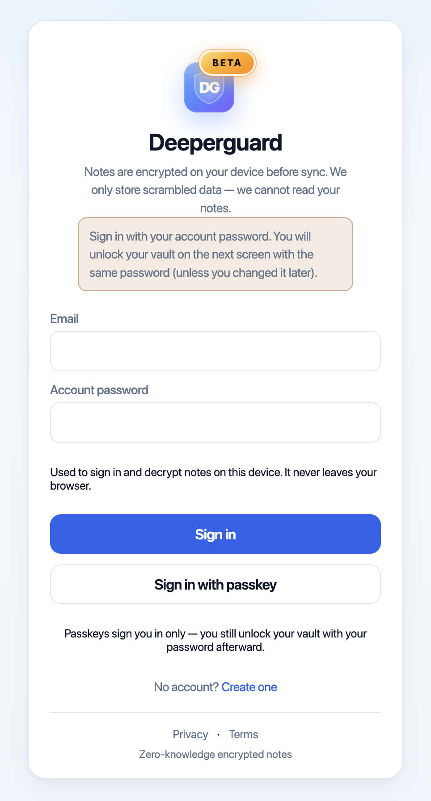

# Deeperguard

Encrypted notes in your browser.

**[Open the notes app](https://www.deeperguard.com/app)**

## What it does

Deeperguard is a notes app that runs in the browser. You write, tag, search, pin, archive, and trash notes, attach files, use checklists and markdown, and scan documents. The same vault opens on your phone or computer, including from the home screen.

## Sign-in

The screen above takes an email and an account password. The password stays in the browser. Sign-in is SRP-6a over SHA-256 and the RFC 5054 2048-bit group: the client sends a proof, and the server stores only a salt and a verifier. A passkey (WebAuthn) can take the place of that step.

The next screen unlocks the vault on the device. The server never checks the vault password. A passkey signs you in only; the vault still unlocks with the password.

## Vault

New vaults derive a 32-byte key with Argon2id: 3 iterations, 64 MiB of memory, parallelism 2, from the password and a per-account salt. Older vaults still open with the legacy SHA-256 derivation.

Titles, bodies, tags, attachments, extracted document text, and version history are encrypted as JSON with AES-256-GCM and a random 12-byte IV before anything is uploaded. Decryption runs in the browser after unlock.

## On the device

The ciphertext is cached in IndexedDB, so notes open offline and the site can be added to the home screen as a PWA. Scans and PDFs are read with Tesseract and pdf.js in the browser; the text is encrypted into the note, and search runs on the decrypted copy locally. Each edit keeps the previous copy inside the encrypted note, so an older version can be restored.

## What the server holds

Ciphertext blobs, the SRP verifier, the account email, sessions, and sync metadata: item ids, timestamps, and sizes. Reminder email does not include note titles.

Accounts are free during the public beta.

[www.deeperguard.com](https://www.deeperguard.com)

## Source

[AGPL-3.0](LICENSE) · [Privacy](docs/PRIVACY.md) · [Self-host](docs/SELF_HOST.md)
